#	AWS CDK実行検証

AWS CDK（Cloud Development Kit）とは、プログラミング言語を使ってAWSのインフラをコードで定義・構築できるツールである。
AWS CDKで書いたコードは内部的にCloudFormationテンプレートに変換されてデプロイされる。
AWS CDKで使用できるプログラミング言語は下記であるが、今回はPythonを使用した内容で検証する。

・TypeScript
・JavaScript
・Python
・Java
・C#
・Go

##	AWS CDK事前準備

(1)	Node.js & npmのインストールを行う。
 
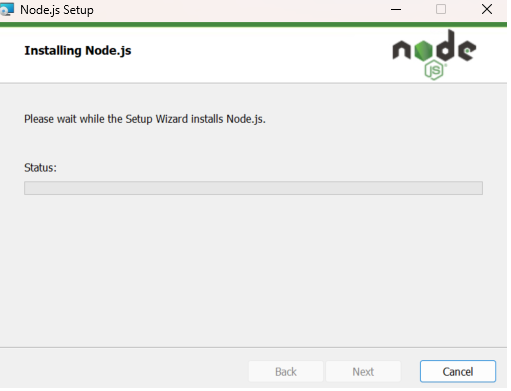
 
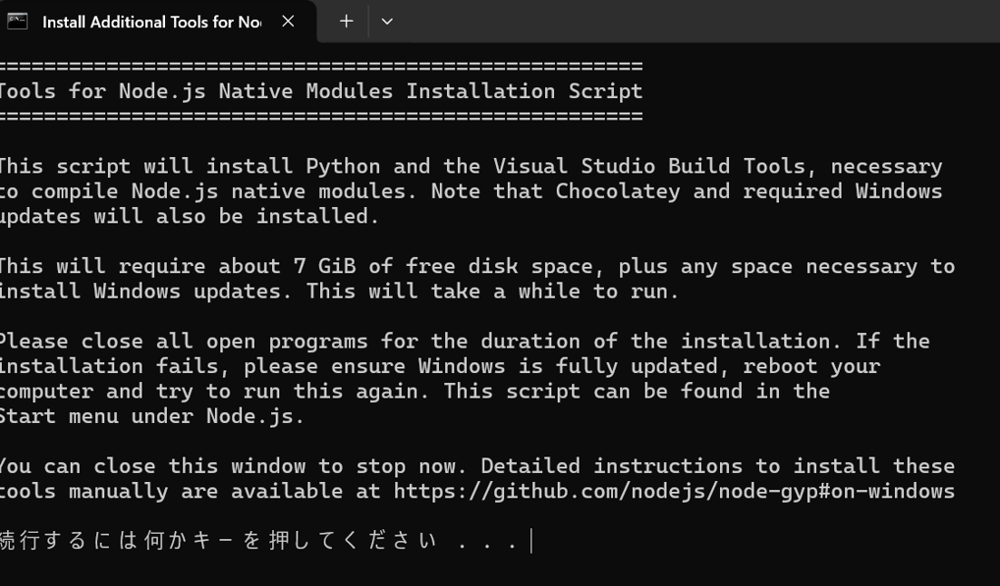

(2)	Node.js & npmのインストール確認を行う。

「node -v」と「npm -v」を実行する。

 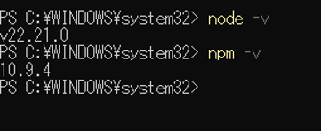

(3)	AWS CDK CLI のインストールを行う。

「npm install -g aws-cdk」を実行する。

 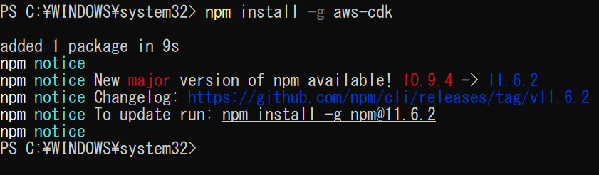

(4)	AWS CDK CLI のインストール後、バージョン確認を行う。
「cdk --version」を実行する。

  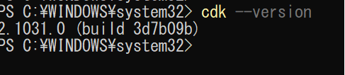

(5)	環境変数にパスを設定する。

「npm list -g」を実行する。

「C:\Users\【ユーザー名】\AppData\Roaming\npm」と表示されるのを確認する。
 
 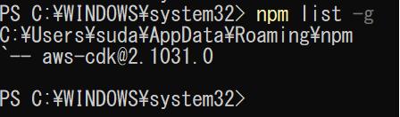

(6)	Pythonをインストール後、バージョン確認を行う。

「python --version」を実行する。

  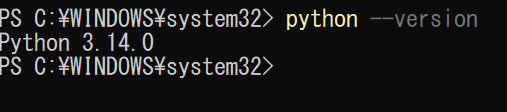

(7)	AWS CDK プロジェクトの初期化を行う。

下記コマンドを任意の場所で実行する。

mkdir <フォルダ名>

cd <フォルダ名>

cdk init app --language python
 
 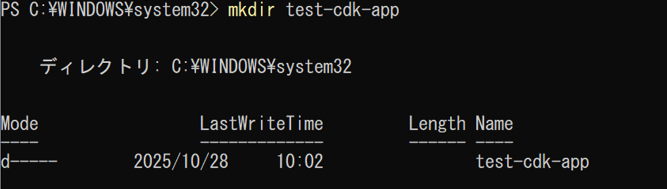

 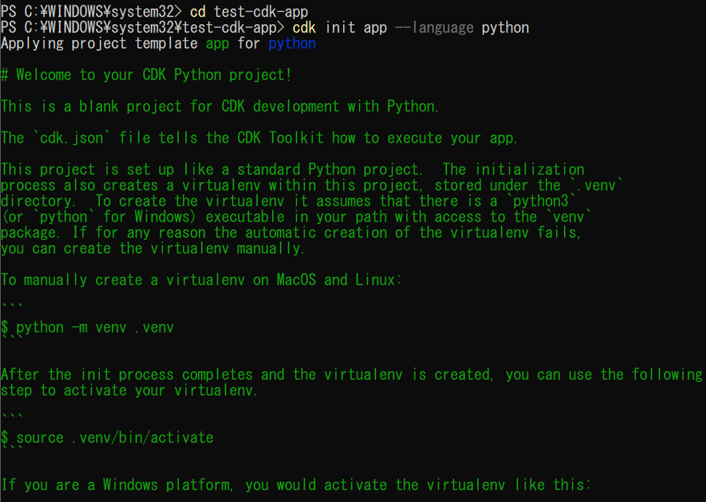
 
～一部省略

 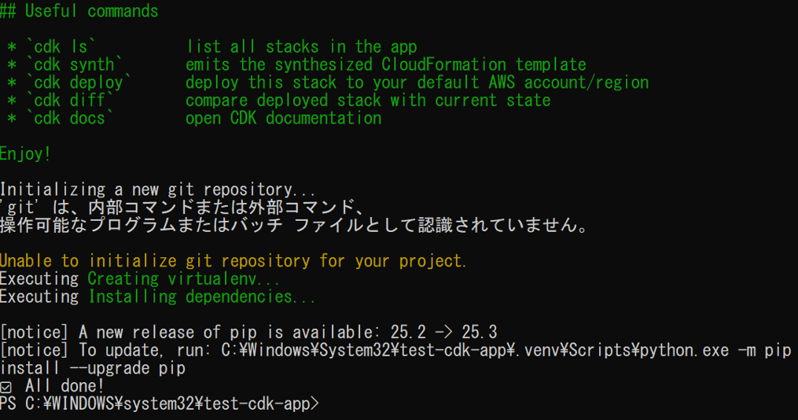

実行後にファイルが作成される。
 　　 　
 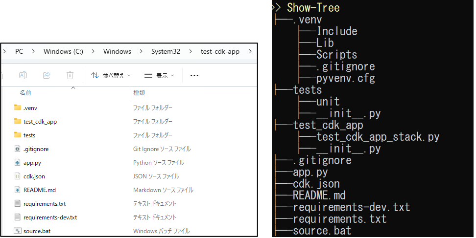

 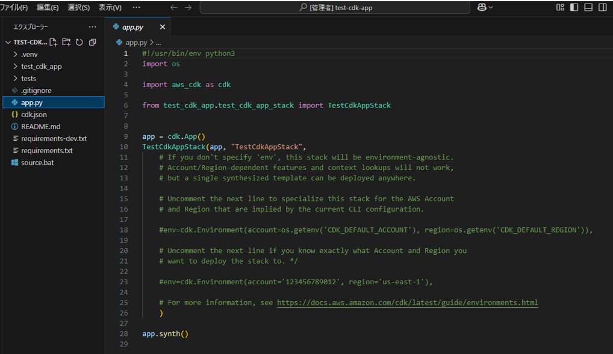 

(8)	必要なライブラリをインストールする。

「pip install aws-cdk-lib constructs」を実行する。
 
 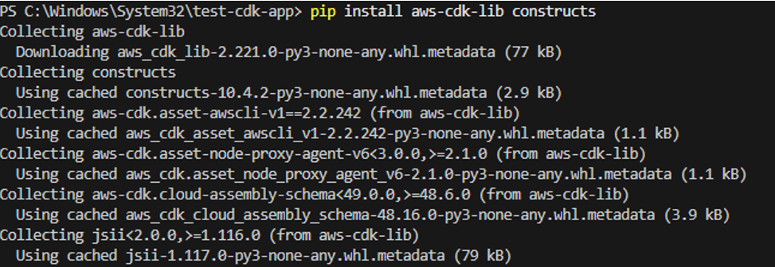  

(9)	「cdk bootstrap」を実行する。

特定のアカウントとリージョンを指定する場合は下記を実行する。

cdk bootstrap aws://<テナントID>/ap-northeast-1

※cdk bootstrap は、AWS CDK が CloudFormation スタックをデプロイするために必要な 事前準備リソース（インフラ）をAWS環境に作成するコマンドである。

 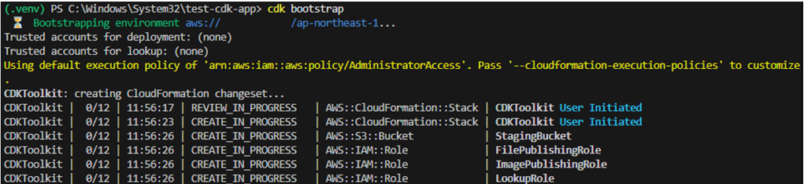   

CDKToolkitが作成される。

CDKToolkit は、cdk bootstrap を実行したときに作成される CloudFormationスタックの名前である。

このスタックが、S3バケットやIAMロールなどを管理している。
 
 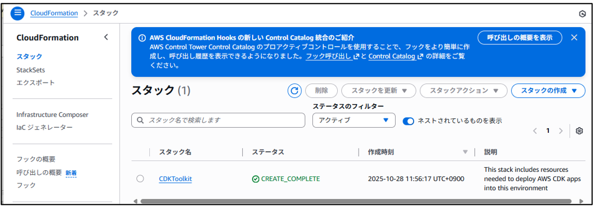  
 
##	AWS CDK動作検証

###	S3作成

(1)	実行用のファイルを作成する。
※作成したファイルと内容は下記を用意した。
ファイル名：s3_stack.py
