#	AWS CDK動作検証

##	S3作成

(1)	実行用のファイルを作成する。

※作成したファイルと内容は下記を用意する。

ファイル名：s3_stack.py

[`s3_stack.py ダウンロード`](./s3_stack.py)

(2)	App.pyに、下記内容を追加する。

from test_cdk_app.s3_stack import S3Stack
S3Stack(app, "S3Stack")

修正前：

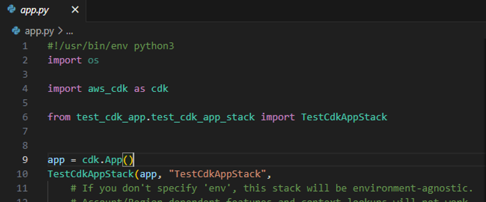

修正後：

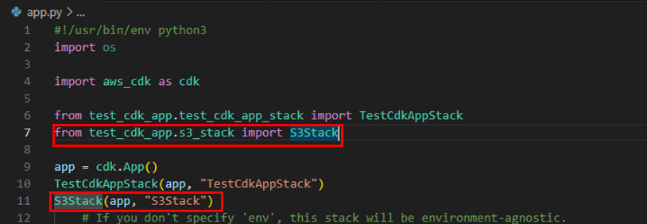

(3)	「cdk synth」を実行する。 

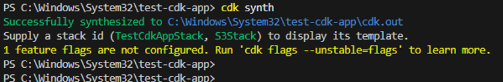

(4)	「cdk ls」を実行し、スタック一覧を表示する。(任意実行)

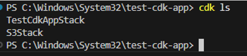

(5)	「cdk deploy」を実行する。
※任意のスタックを実行する場合は下記を実行する。
cdk deploy <スタックを指定する場合はスタック名>

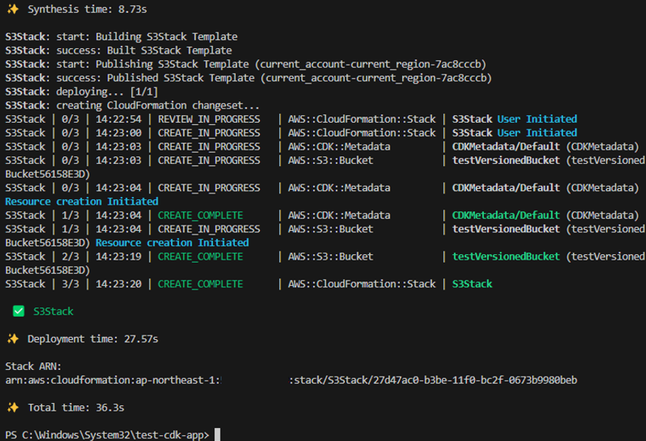

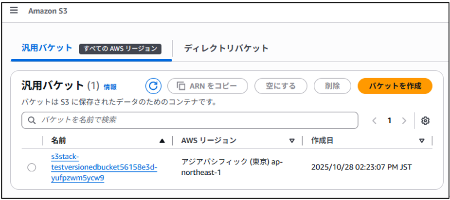

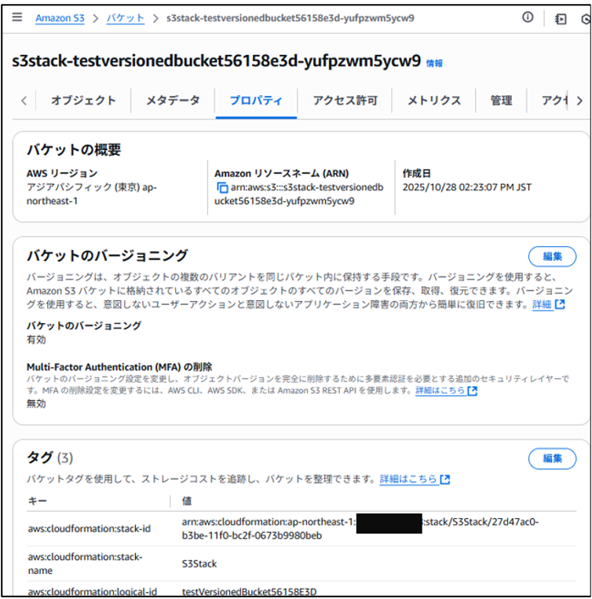

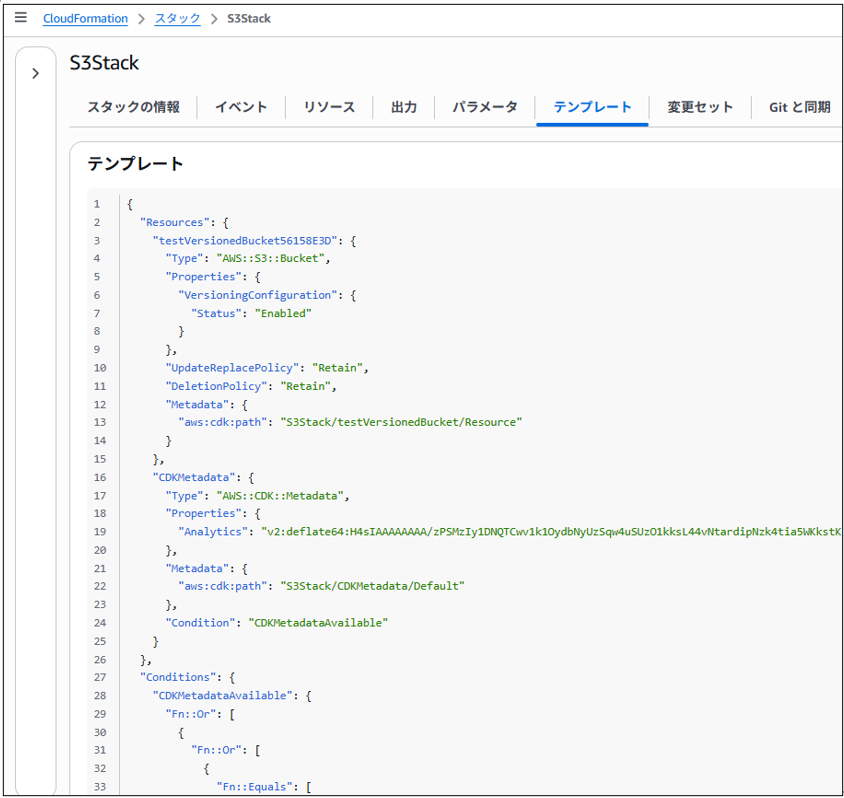

##	VPC EC2作成　

(1)	実行用のファイルを作成する。

※作成したファイルと内容は下記を用意した。

ファイル名：aws_make.py

[`aws_make.py ダウンロード`](./aws_make.py)

(2)	App.pyに、下記内容を追加する。

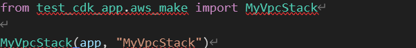

(3)	「cdk deploy」を実行する。

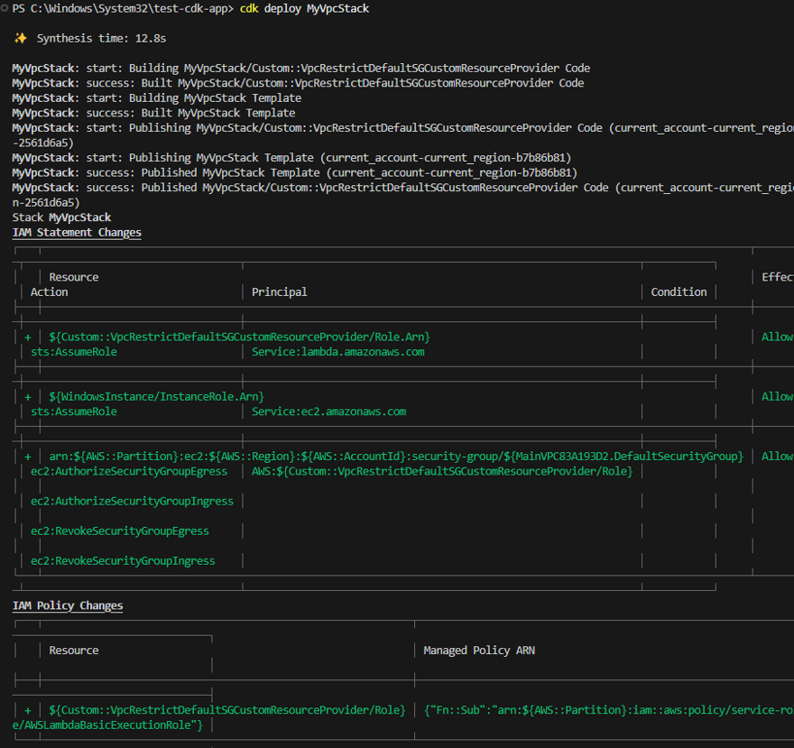

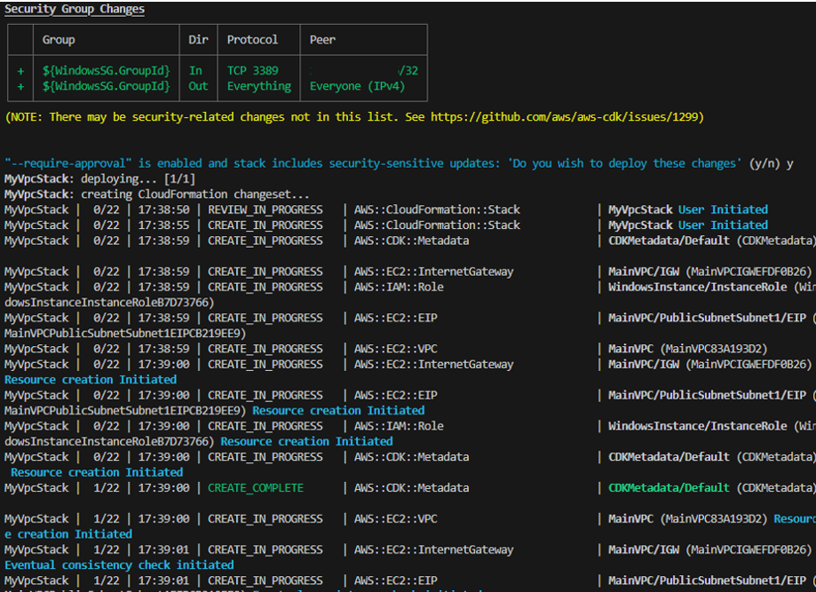

下記省略

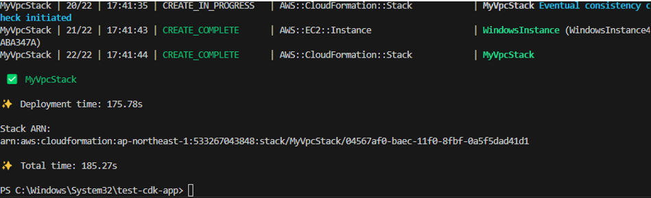

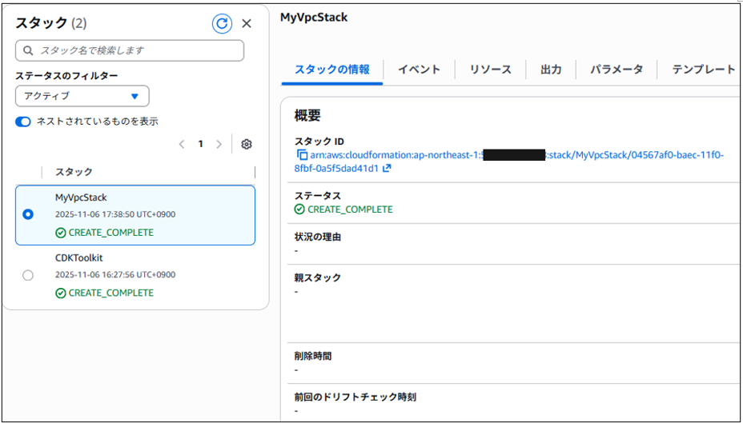

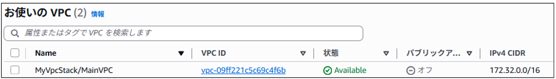

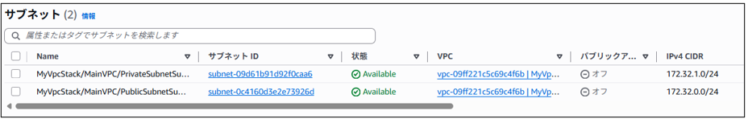

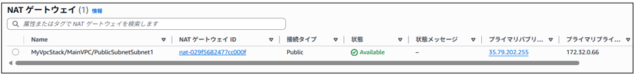

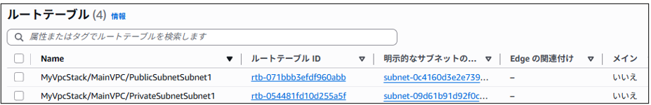

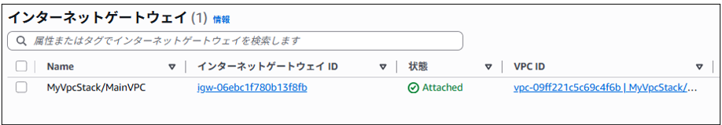

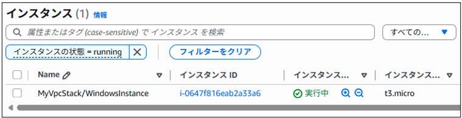

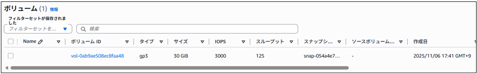

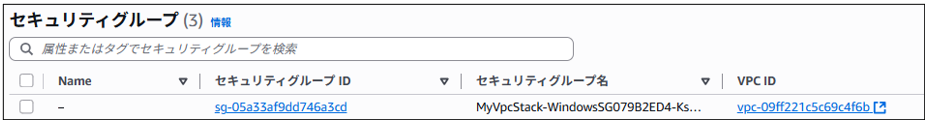

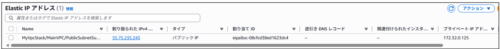

接続確認

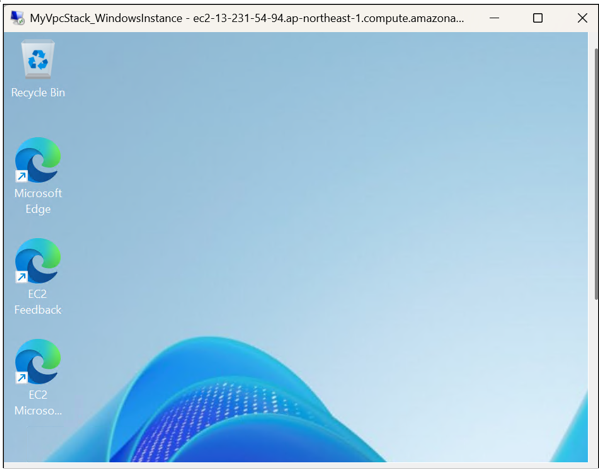

メモ：

・CDK では VPC 作成時に インターネットゲートウェイ、ルートテーブル、NAT ゲートウェイが自動で設定される。

ただし、細かく制御したい場合は CfnRouteTable, CfnRoute, CfnInternetGateway を使って明示的に定義できる。

・CDK では PRIVATE_WITH_EGRESS を使うと NAT Gateway が自動で作成される。手動で制御したい場合は CfnNatGateway を使用する。
