# GitHubリポジトリにコードをpushする

##	準備

(1)	GitHub上でPrivate リポジトリを作成する。

 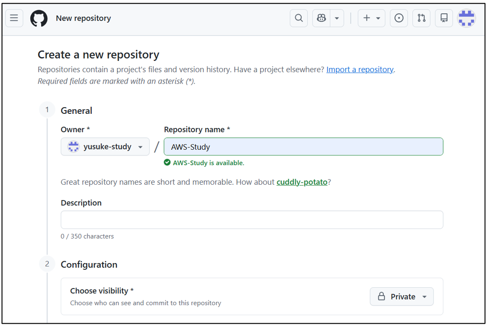
 
(2)	GitHub上でコードをプッシュするためのカギを作成する。

※Settings →　Developer Settings　 →　Personal access tokens (classic)

  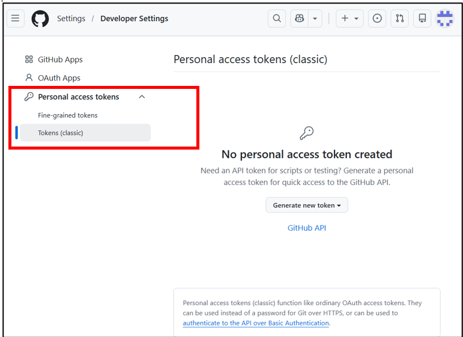

(3)	鍵の名前、使用期間、スコープにレジストリーを選択し、作成する。
 
 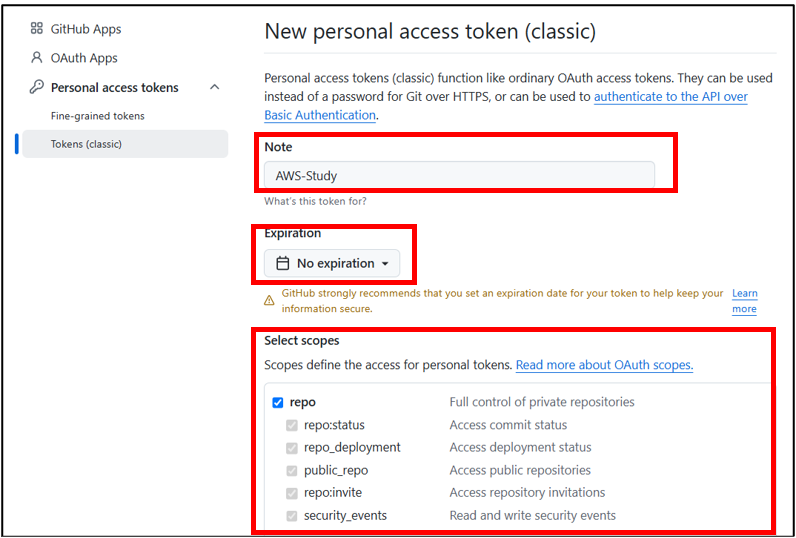
 
(4)	鍵のキーを取得する。

 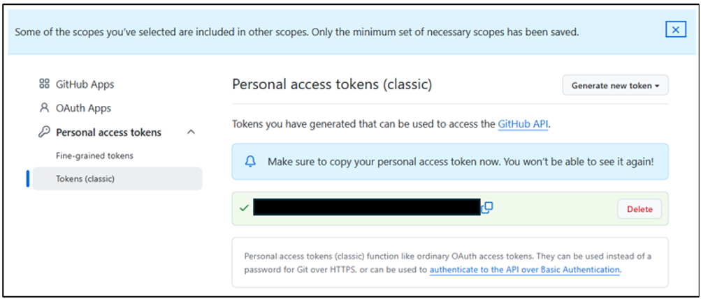
 
##	GitHubリポジトリにコードをpushする

(1)	Amazon Linux環境にGitをインストールする。※cloud shell上で操作する場合は不要。

コマンド：sudo dnf install git -y

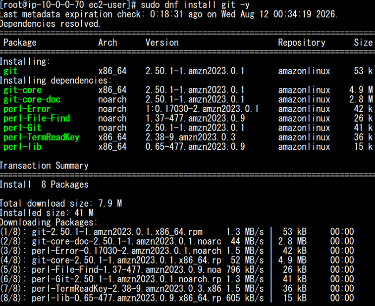 

(2)	Githubのコードを取得する。

コマンド：git clone https://github.com/<その後のディレクトリ>

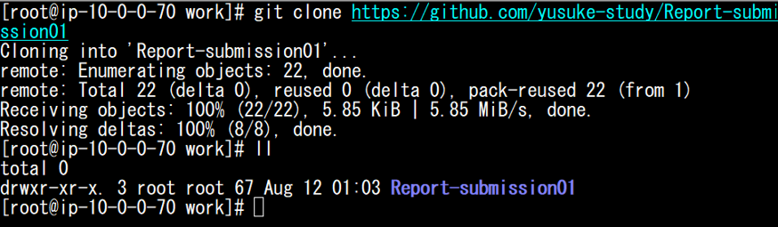 

(3)	Pushする用のファイル(フォルダ)を用意する。

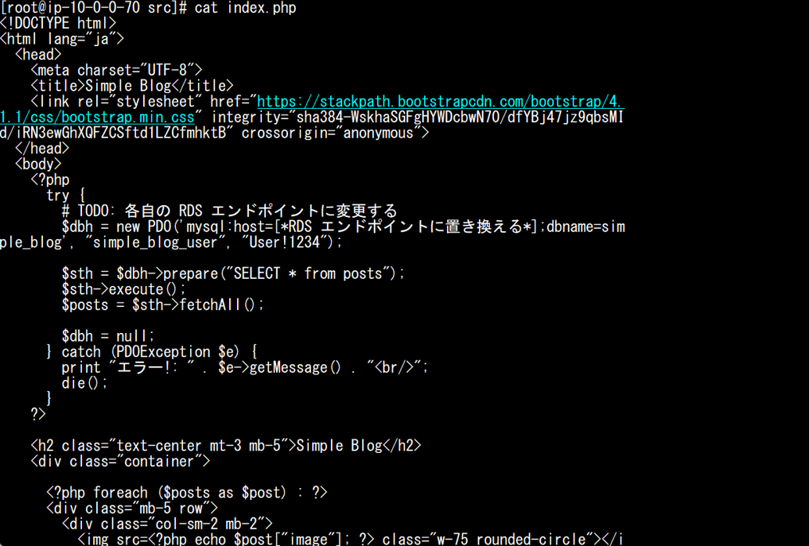 

(4)	現在いるディレクトリをGit管理対象にする。

コマンド：git init

※実行すると、そのディレクトリに隠しディレクトリ.gitが作られ、コミット履歴やブランチ情報が保存される。

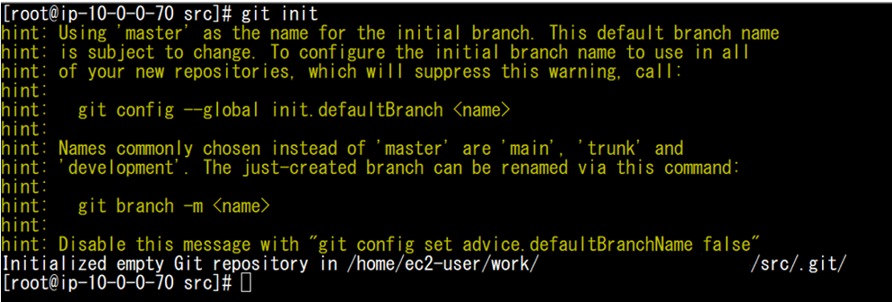  

(5)	現在の変更を「次のコミット対象」に登録する。

コマンド：git add -A

git add した変更を、Gitの履歴として保存する。

コマンド：git commit -m "first commit"

現在のブランチ名を main に変更する。

コマンド：git branch -M main

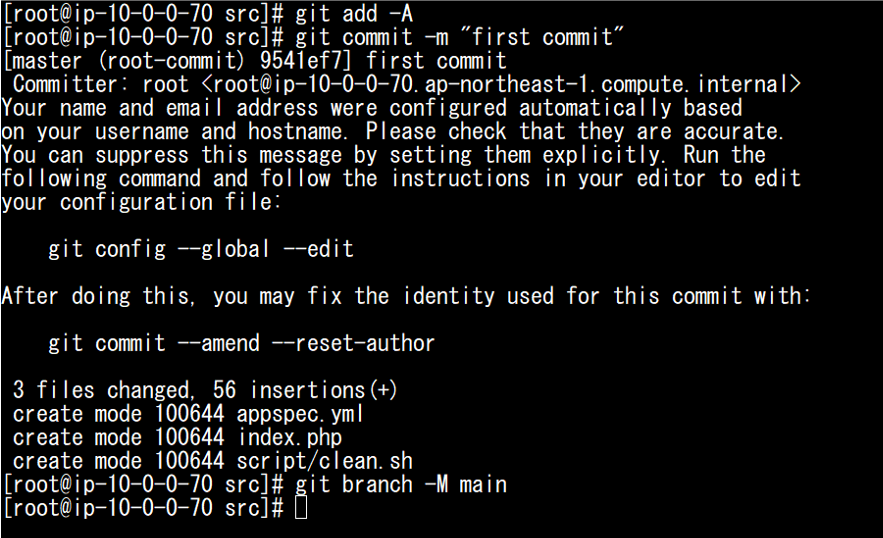 

(6)	ローカルGitとGitHubリポジトリの「接続先」を登録する。

コマンド：git remote add origin [GitHubのURL]

ローカルの main ブランチの内容を、GitHubの origin にアップロードする。

コマンド：git push -u origin main

　　　※ユーザー名とPersonal access tokens (classic)を入力する。

 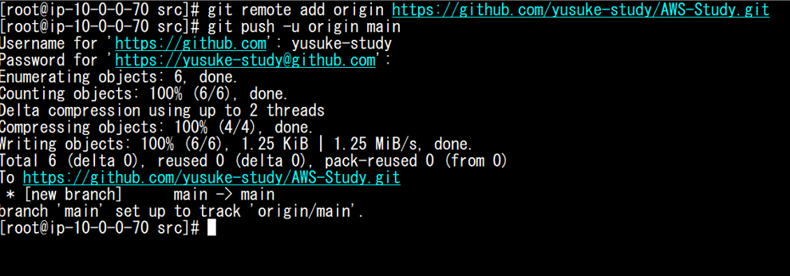 

(7)	コピー先のGitHubを確認する。

 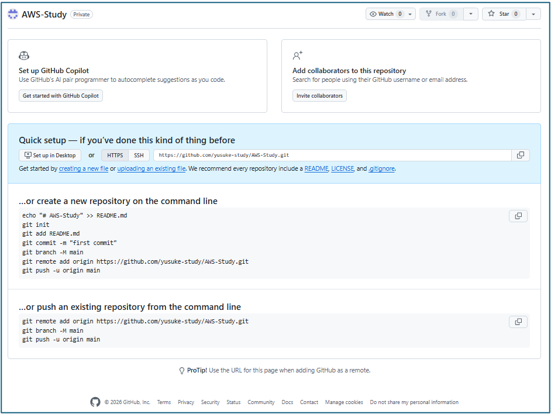  

(8)	画面をリロードする。

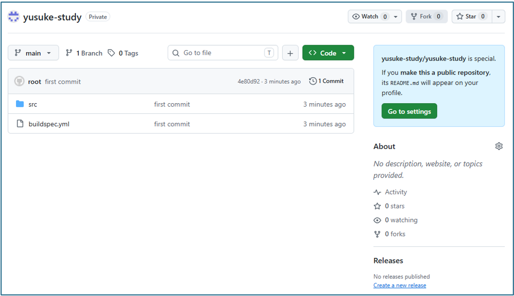 

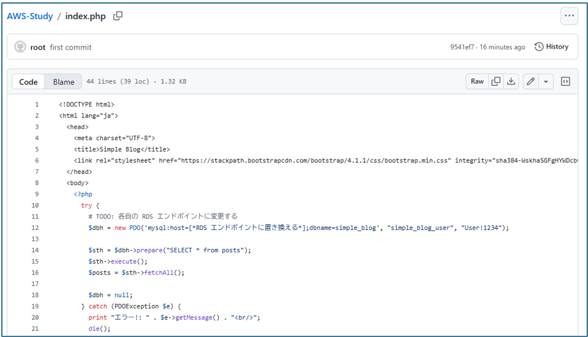 
 
## その他の補足コマンド

・GitHubとの接続先登録

コマンド：git remote -v

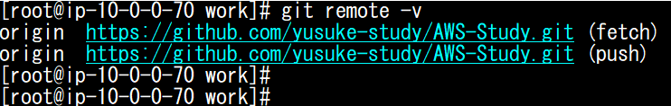   

・Gutのステータスを表示する。

コマンド：git status

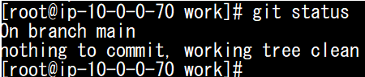  
 
・現在のブランチ → main 

・未コミットの変更 → なし 

・作業ツリー → クリーン

・Gitのログを表示する

コマンド：git log --oneline

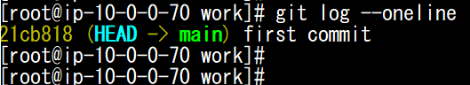  
 
