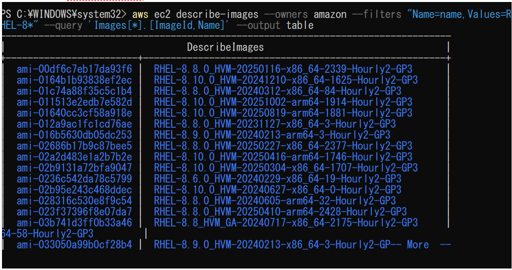
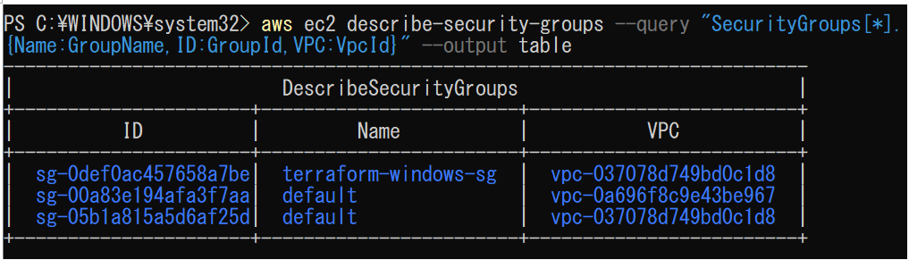
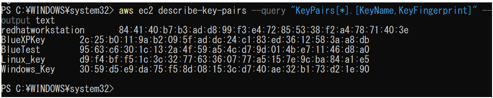
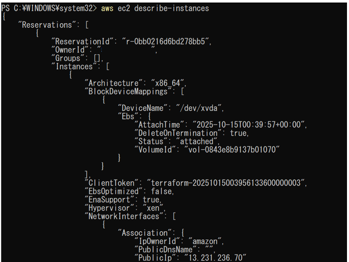
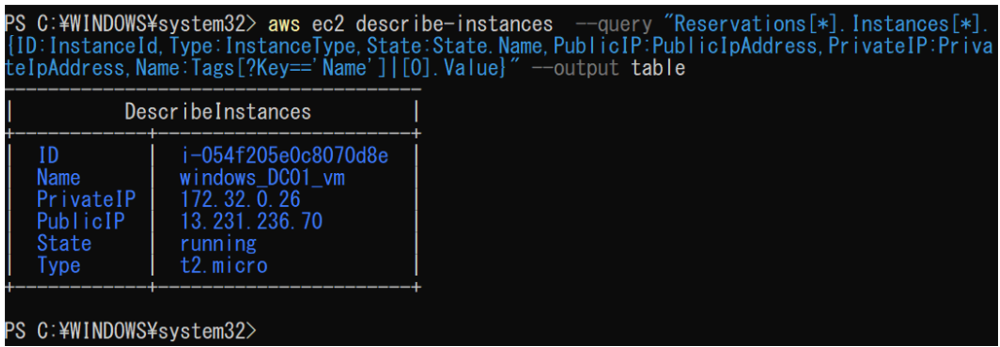

# EC2

##EC2関連確認

EC2に関連するシステムの確認を行うコマンドについて記載する。

(1)	AMI IDを検索する。
「aws ec2 describe-images --owners amazon --filters "Name=name,Values=<キーワード>" --query 'Images[*].[ImageId,Name]' --output table」を実行する。

例：aws ec2 describe-images --owners amazon --filters "Name=name,Values=RHEL-8*" --query 'Images[*].[ImageId,Name]' --output table

(2)	セキュリティグループを表示する。
「aws ec2 describe-security-groups --query "SecurityGroups[*].{Name:GroupName,ID:GroupId,VPC:VpcId}" --output table」を実行する。

 

(3)	キーペアを表示する。
「aws ec2 describe-key-pairs --query "KeyPairs[*].[KeyName,KeyFingerprint]" --output text」を実行する。
 

(4)	EC２を表示する。
「aws ec2 describe-instances」を実行する。

 

(5)	EC２の主要な内容のみ出力する。

aws ec2 describe-instances  --query "Reservations[*].Instances[*].{ID:InstanceId,Type:InstanceType,State:State.Name,PublicIP:PublicIpAddress,PrivateIP:PrivateIpAddress,Name:Tags[?Key=='Name']|[0].Value}" --output table   を実行する。

