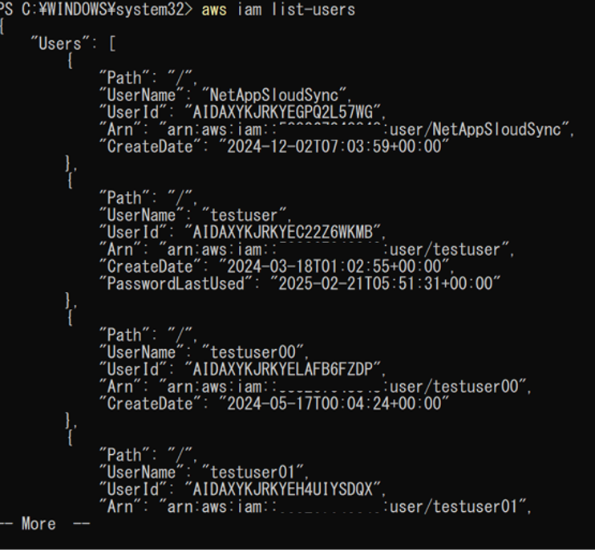
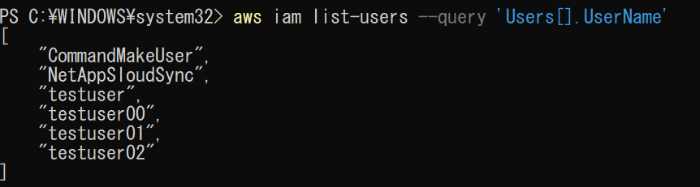

# IAM  

## IAM ユーザー

IAMユーザーに関連するコマンドを記載する。

(1)	AWSユーザー一覧を表示する。

「aws iam list-users」を実行する。
 

(2)	ユーザー名だけ出力する。

「aws iam list-users `--query` 'Users[].UserName'」を実行する。

## IAM グループ

## IAM ポリシー

## IAM ロール

## AWS Organizations
