#	AWS SDK実行検証

AWS SDKの実行検証結果を下記に記載する。

## AWS SDK事前準備

(1)	VSCode（Visual Studio Code）を起動する。

(2)	Pythonをインストールする。
 
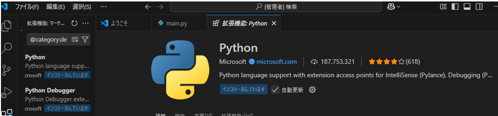

(3)	VSCodeのメニューから「ターミナル」 > 「新しいターミナル」を選択して、ターミナルをクリックする。

(4)	ターミナルで、「pip install boto3」を実行する。
※boto3をインストールする。
 
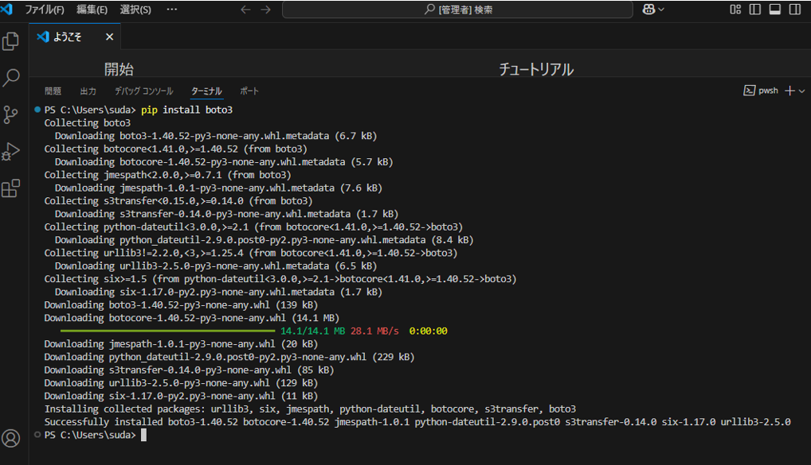

(5)	「aws configure」を実行する。
 
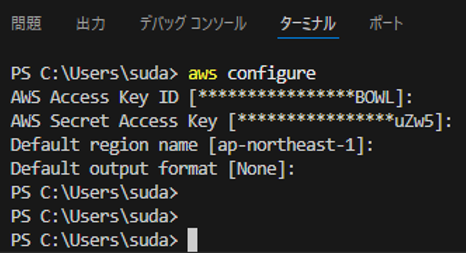
 
##	AWS SDK動作検証

### S3バケット一覧表示

下記は、S3の汎用バケットを一覧表示するPythonコードの実行結果を下記に記載する。

(1)	事前にAWS上に汎用バケットを作成する。

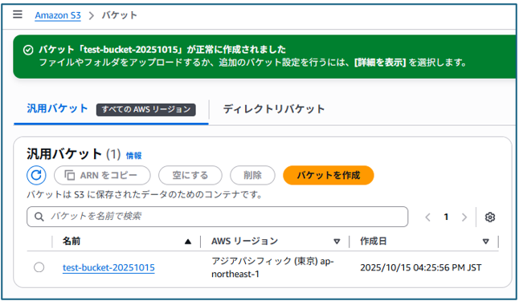

(2)	ターミナルで、下記内容の「main.py」を作成し、コードを実行する。
※S3バケットの一覧を取得する

[`main.py ダウンロード`](./main.py)

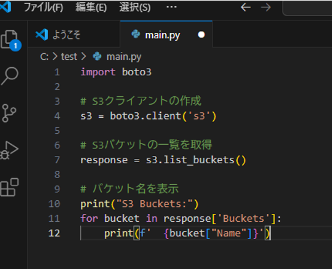

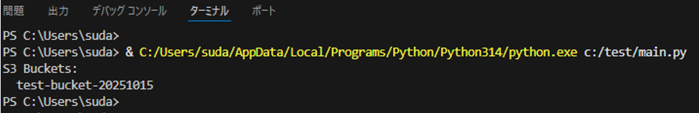

###	S3にファイルアップロード

下記は、S3の汎用バケット内に、ファイルをアップロードさせた実行結果を下記に記載する。

(1)	ターミナルで、下記内容の「upload_to_s3.py」を作成し、コードを実行する。
S3にファイルを新規作成する。

[`upload_to_s3.py ダウンロード`](./upload_to_s3.py)

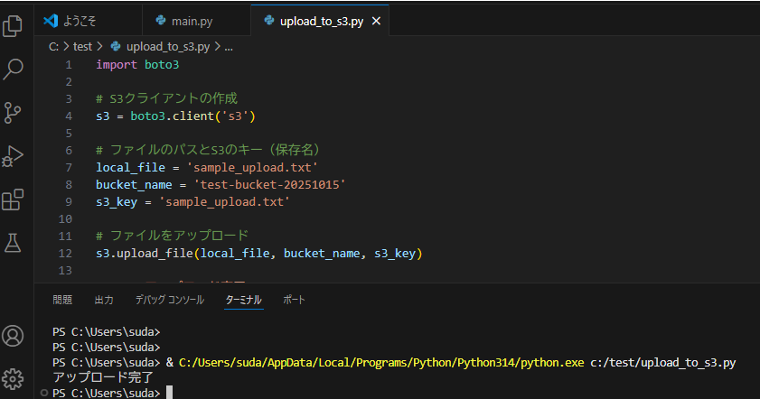

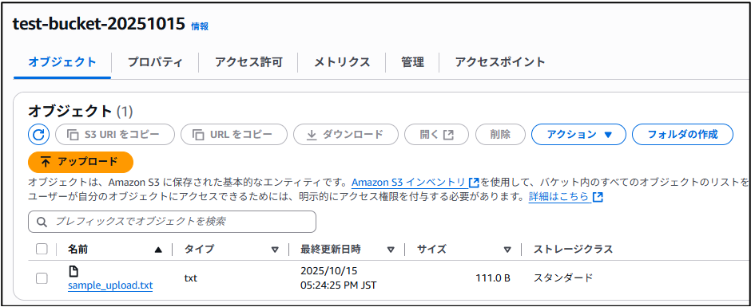

###	S3ファイル新規作成

下記は、S3の汎用バケット内に、ファイルを新規作成させた実行結果を下記に記載する。

(1)	ターミナルで、下記内容の「S3_makefile_s3.py」を作成し、コードを実行する。
S3にファイルを新規作成する。

[`S3_makefile_s3.py ダウンロード`](./S3_makefile_s3.py)

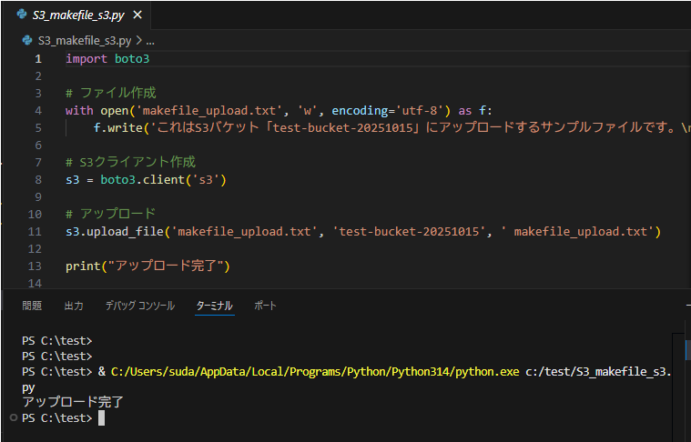

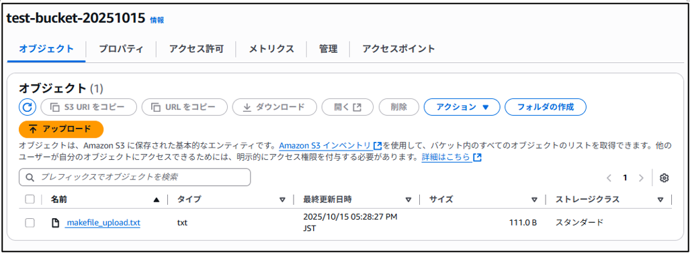

結果：test-bucket-20251015に、sample_upload.txtが作成される。

###	S3アクセス権設定

下記は、S3の汎用バケットの、パブリックアクセスブロックの解除と、バケットポリシーの設定を全員に読み取り許可に変更させた実行結果を下記に記載する。

(1)	ターミナルで、下記内容の「S3_Access Rights.py」を作成し、コードを実行する。

[`S3_Access Rights.py ダウンロード`](./S3_Access Rights.py)

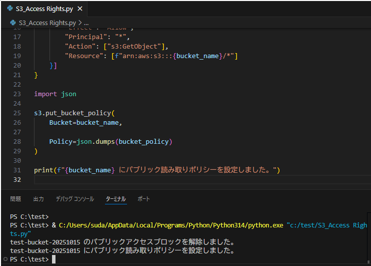

参考:コード実行前

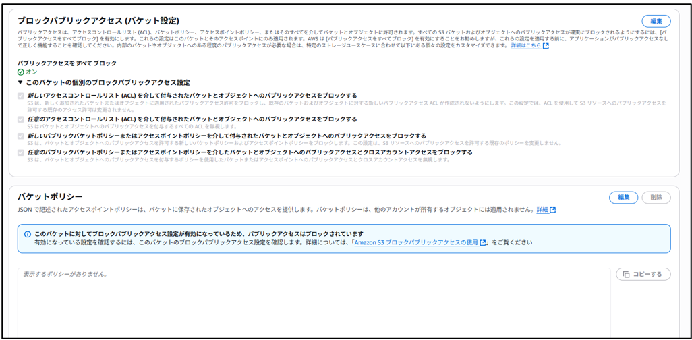

参考:コード実行後

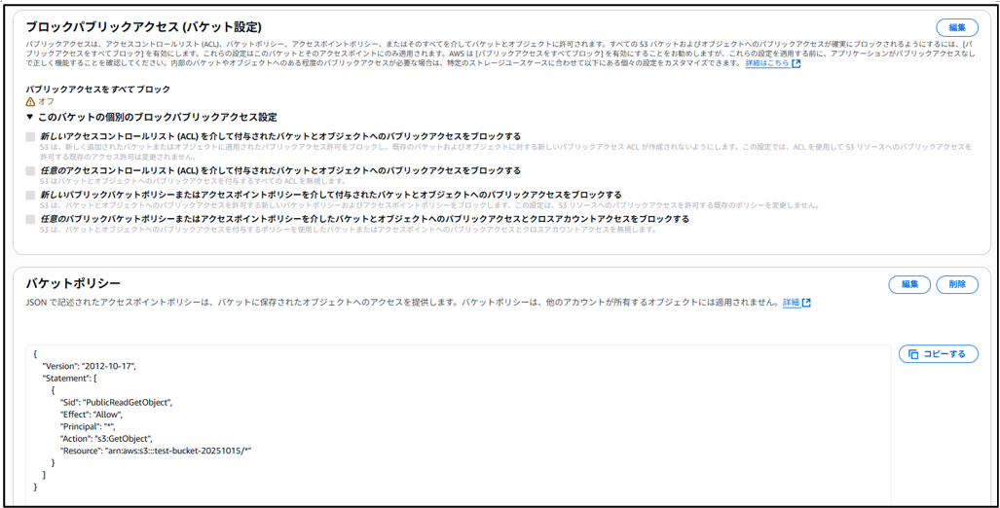

###	EC2_VPC作成

下記は、EC2インスタンス(Amazon Linux)と、それを実行させるために必要な最低限のシステム(VPC等)を作成させた実行結果である。

(1)	ターミナルで、下記内容の「create_EC2_vpc.py」を作成し、コードを実行する。
※EC2インスタンスのImageIdは、よく変わるので注意

[`create_EC2_vpc.py ダウンロード`](./create_EC2_vpc.py)
 
###	EC2_VPC全削除

下記は、EC2インスタンスとVPC関連の下記コードに入力されているシステムを全て削除するコードの実行結果を下記に記載する。
※キーペアは含まない。
※デフォルトで削除できないシステム(セキュリティグループ、VPC、サブネットルートテーブル、)は削除しない。

(1)	ターミナルで、下記内容の「delete_EC2_vpc.py」を作成し、コードを実行する。

[`delete_EC2_vpc.py ダウンロード`](./delete_EC2_vpc.py)

メモ①：デフォルトで削除できないシステム(セキュリティグループ、VPC、サブネットルートテーブル、)は削除失敗となるが、メッセージを出力しないために、下記内容でコードを修正した。

[`SDK_修正後コード ダウンロード`](./SDK_修正後コード.txt)

