# VPC  

VPCに関連するシステムの確認を行うコマンドについて記載する。

前提条件として、AWS CLIにログインした状態であること。

## VPC関連確認(主要情報のみ)

VPCに関連するシステムの確認を行うコマンドについて、主要情報のみ出力させるコマンドを記載する。

(1)	VPCの主要な内容のみ出力する。

「aws ec2 describe-vpcs `--query` "Vpcs[*].[VpcId,CidrBlock,IsDefault]" `--output` text」を実行する。

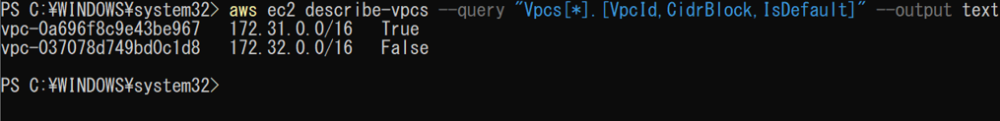

(2)	サブネットの主要な内容のみ出力する。

「aws ec2 describe-subnets  `--query` "Subnets[*].[SubnetId,AvailabilityZone,CidrBlock,VpcId]"  `--output` text」を実行する。

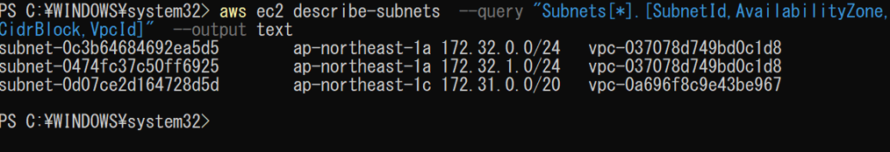

(3)	ルートテーブルの主要な内容のみ出力する。

「aws ec2 describe-route-tables `--query` "RouteTables[*].[RouteTableId,VpcId]" `--output` text」を実行する。

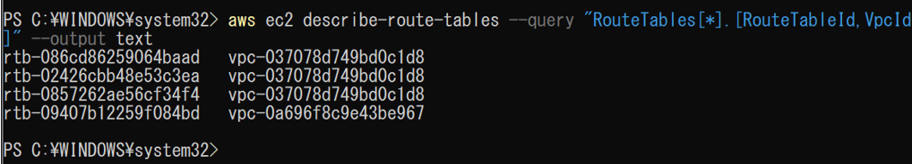

(4)	インターネットゲートウェイの主要な内容のみ出力する。

「aws ec2 describe-internet-gateways `--query` "InternetGateways[*].[InternetGatewayId,Attachments[0].VpcId]" `--output` text」を実行する。

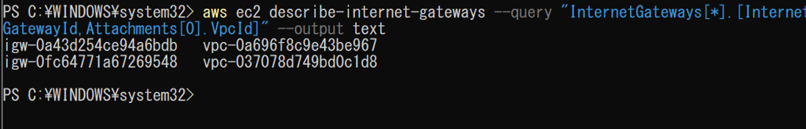

(5)	Elastic IP の主要な内容のみ出力する。

「aws ec2 describe-addresses `--query` "Addresses[*].{PublicIP:PublicIp,AllocationId:AllocationId,InstanceId:InstanceId}" `--output` table」を実行する。

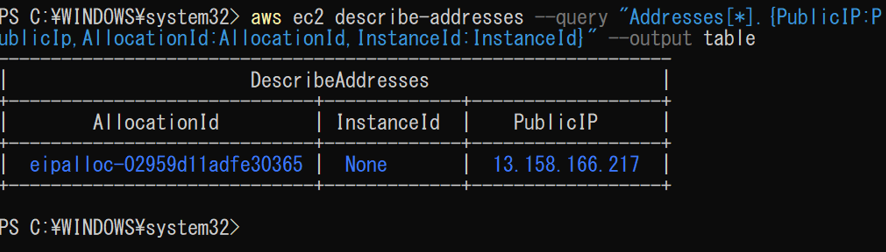

(6)	NAT ゲートウェイの主要な内容のみ出力する。

「aws ec2 describe-nat-gateways `--query` "NatGateways[*].{ID:NatGatewayId,State:State,Subnet:SubnetId,PublicIP:NatGatewayAddresses[0].PublicIp}" -`-output` table」を実行する。

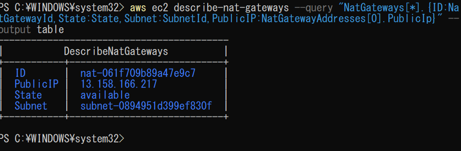

## VPC関連確認

VPCに関連するシステムの確認を行うコマンドについて記載する。

(1)	作成されているVPCを確認する。

「aws ec2 describe-vpcs」を実行する。

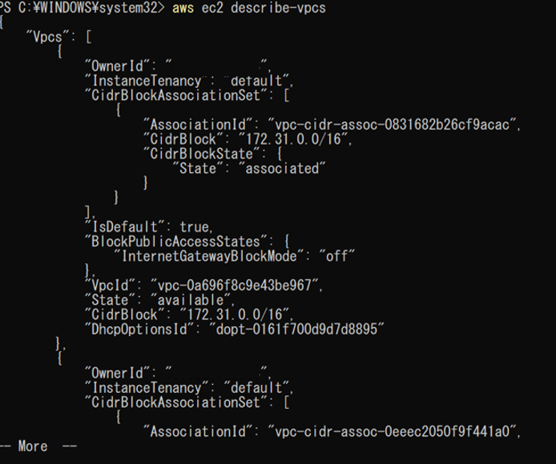

(2)	作成されているサブネットを確認する。

「aws ec2 describe-subnets」を実行する。
 
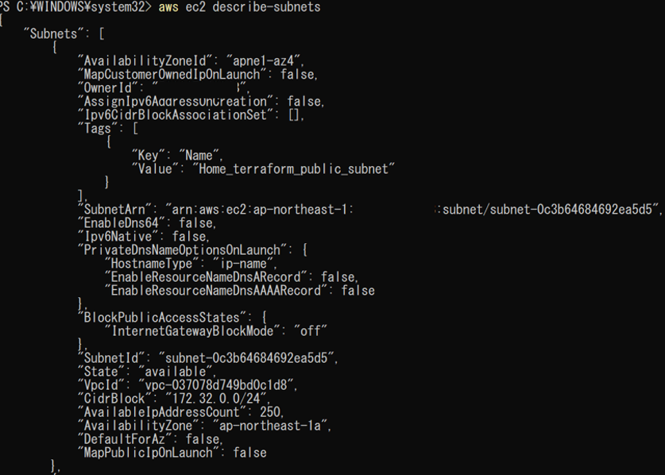

(3)	作成されているルートテーブルを確認する。

「aws ec2 describe-route-tables」を実行する。

 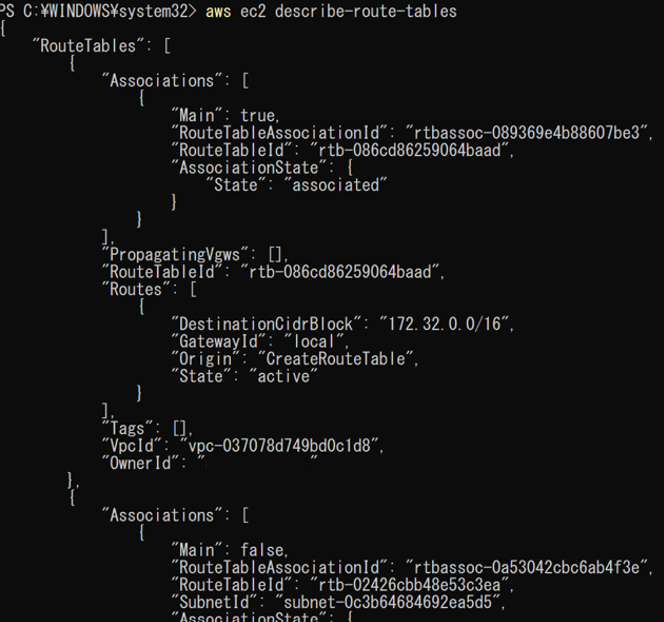

(4)	作成されているインターネットゲートウェイを確認する。

「aws ec2 describe-internet-gateways」を実行する。

 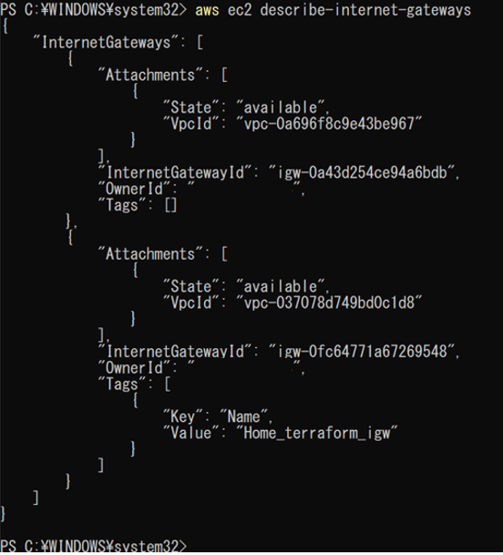

(5)	Elastic IP を確認する。

「aws ec2 describe-addresses」を実行する。

 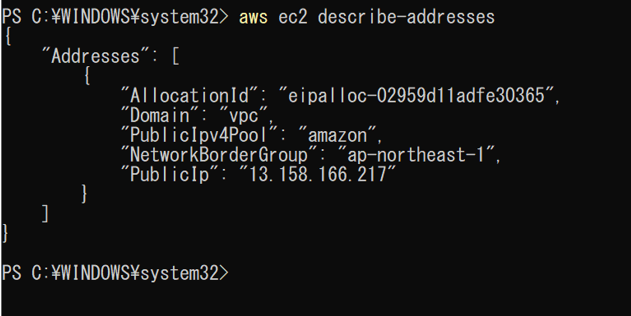

(6)	NAT ゲートウェイを確認する。

「aws ec2 describe-nat-gateways」を実行する。

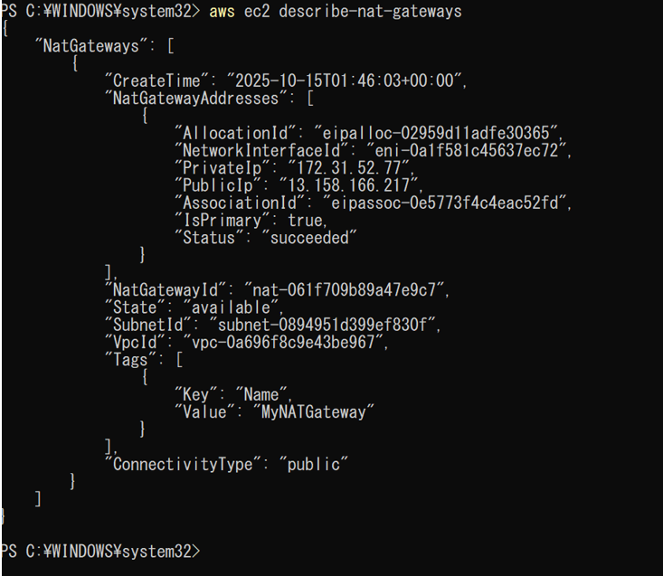

## VPC関連作成

## VPC関連削除

## VPC関連備考
