### 概要
 
AWS ECS（Amazon Elastic Container Service） は、DockerコンテナなどをAWS上で実行・管理するためのフルマネージドなコンテナオーケストレーションサービスである。

コンテナオーケストレーションサービスとは、多数のコンテナを自動で配置・起動・停止・監視・スケールしてくれる管理サービスである。 

■ECSを構成する主なコンポーネント 

 
■起動タイプの選択　(ECSを構成する2つの起動タイプについて) 

 
 
 
### 作成イメージ

・最小限な構成でECSを使用する。 
・Nginx用のコンテナをダウンロードして、それをデプロイする。 
・VPC内のpublic subnetの中にECSを通じてnginxのコンテナをデプロイする。 
・起動タイプはfargateを使用する。 
・コンテナにpublic IPを付与する。 
※ECRを使用しない。 

成功：
public IPを通じてNginxの画面が表示される。

### クラスターの作成　ECS

(1)	クラスターを作成する。

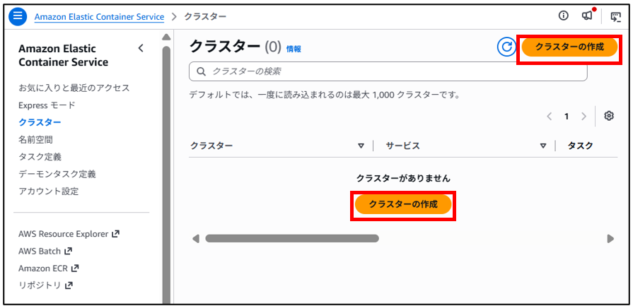

(2)	クラスター名とインフラストラクチャを選択する。
※その他の設定は特に重要事項がないため省略し、作成する。

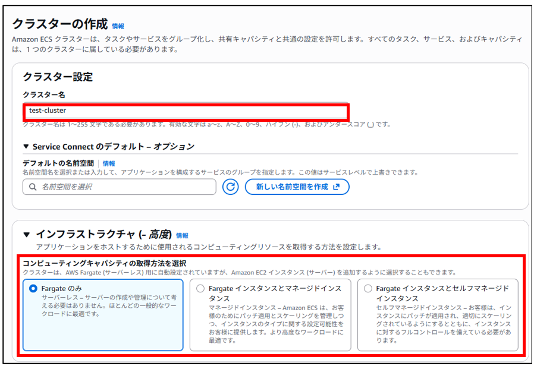

(3)	クラスターが作成される。

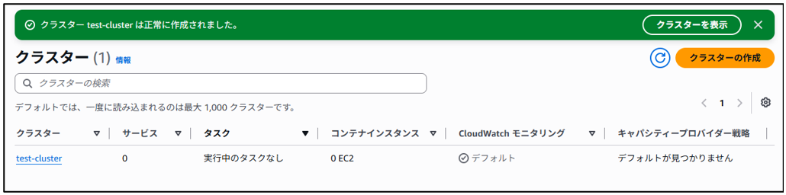

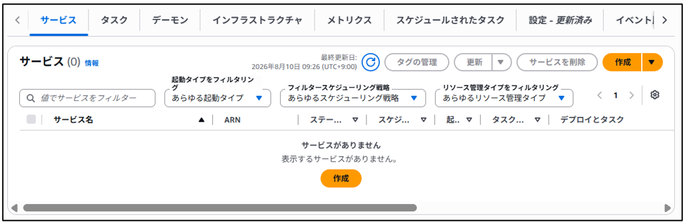

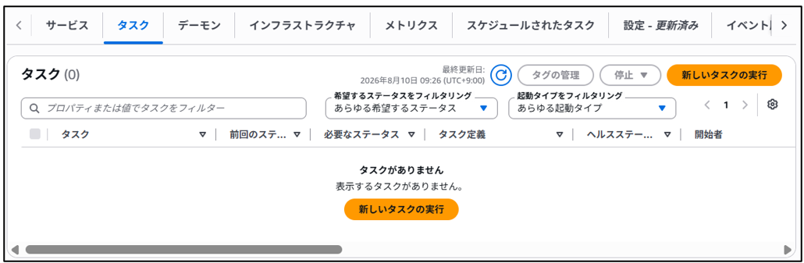

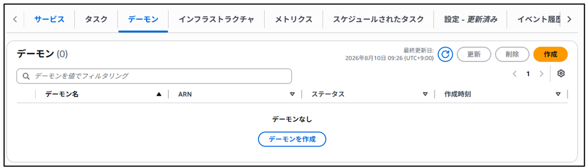

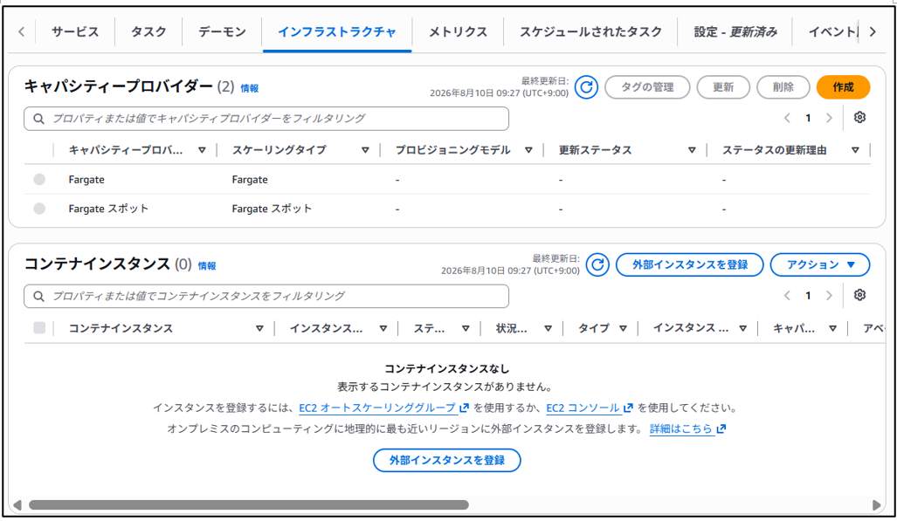

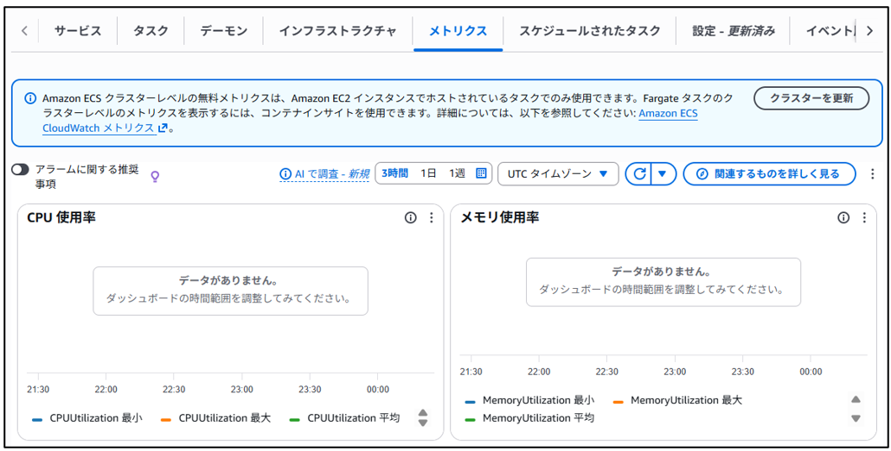

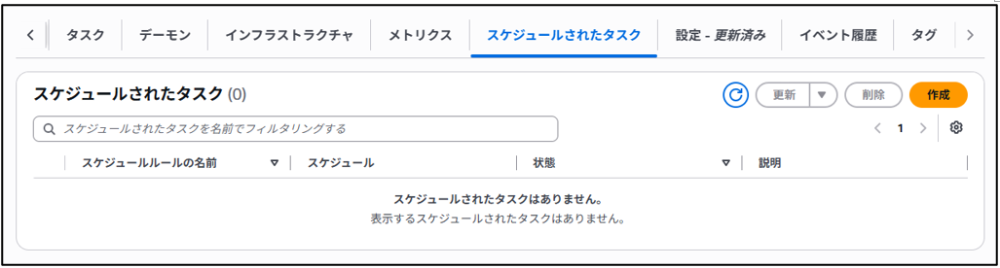

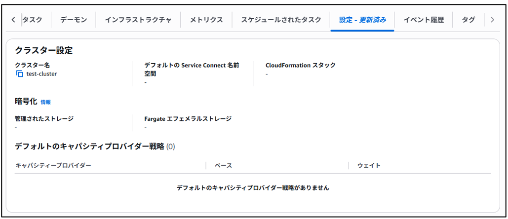

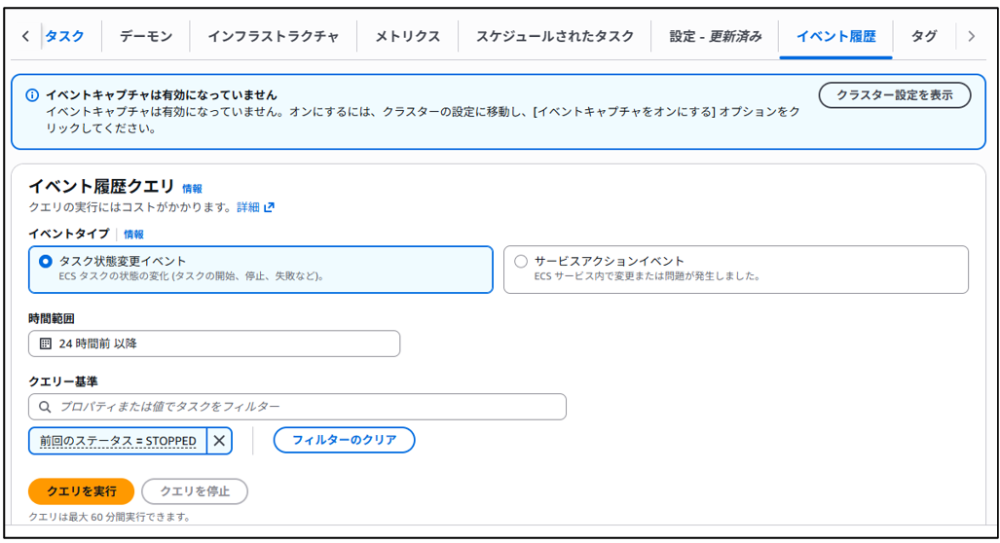

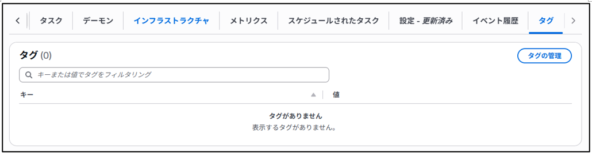

### タスク定義の作成　ECS

(1)	タスク定義を作成する。
　※画面上での設定と、JSON形式から作成することも可能。
 

※JSON形式での作成画面が下記になる。※参考
 
 

(2)	タスク定義の名前、起動タイプ、OS、アーキテクチャーを選択する。

 

(3)	タスクで使用するCPUやメモリサイズを指定する。
 ※Fargateが実行されるサーバーのサイズ。使用するアプリケーションの用途に応じて変更

(4)	タスクロール、タスク実行ロールを作成or選択する。 
※事項タスクロールの作成について記載
 

 

(5)	コンテナイメージを作成する。
※1つのタスクの中に複数のコンテナの作成が可能。

イメージURIにコンテナイメージ(ECRのリポジトリー)を指定する。
コンテナイメージの調べ方は下記を参照する。
AWS ECR Public :  https://gallery.ecr.aws/

 

 
(6)	例：nginxのリポジトリーを使用したいとき、用途に応じてURLを選択し、コピーする。

 

(7)	コンテナにアサインするポート等を選択する。

 

(8)	ログを収集したい時CloudWatchを選択する。
 

(9)	タスク定義が作成される。

 
※タスク定義の番号(バージョン)　:1　
新しいアプリのコンテナイメージをアップデートする際、タスク定義をバージョンアップさせ、適応させるイメージ。
新しく作成させる場合は、「新しいリビジョンの作成」から行う。
