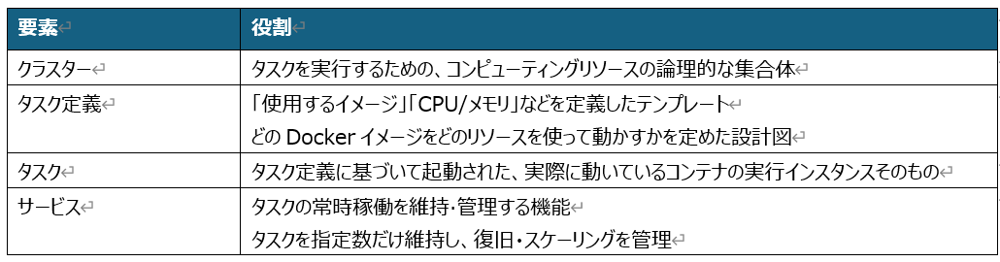
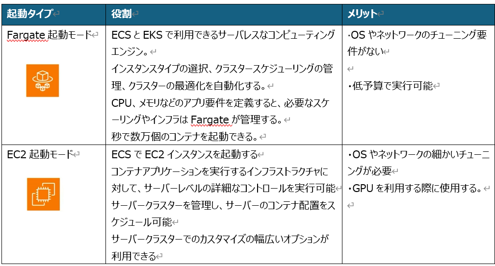

### 概要
 
AWS ECS（Amazon Elastic Container Service） は、DockerコンテナなどをAWS上で実行・管理するためのフルマネージドなコンテナオーケストレーションサービスである。

コンテナオーケストレーションサービスとは、多数のコンテナを自動で配置・起動・停止・監視・スケールしてくれる管理サービスである。 

■ECSを構成する主なコンポーネント 

 
■起動タイプの選択　(ECSを構成する2つの起動タイプについて)  

 
 
 
### 作成イメージ
 
・最小限な構成でECSを使用する。 
・Nginx用のコンテナをダウンロードして、それをデプロイする。 
・VPC内のpublic subnetの中にECSを通じてnginxのコンテナをデプロイする。 
・起動タイプはfargateを使用する。 
・コンテナにpublic IPを付与する。 
※ECRを使用しない。  

成功：

public IPを通じてNginxの画面が表示される。

