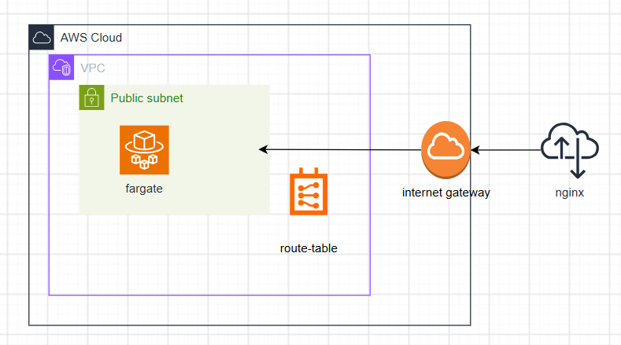

- 概要
 
AWS ECS（Amazon Elastic Container Service） は、DockerコンテナなどをAWS上で実行・管理するためのフルマネージドなコンテナオーケストレーションサービスである。

コンテナオーケストレーションサービスとは、多数のコンテナを自動で配置・起動・停止・監視・スケールしてくれる管理サービスである。 

■ECSを構成する主なコンポーネント 

| 要素 | 役割 |
|---|---|
| クラスター | タスクを実行するための、コンピューティングリソースの論理的な集合体 |
| タスク定義 | 「使用するイメージ」「CPU/メモリ」などを定義したテンプレート どのDockerイメージをどのリソースを使って動かすかを定めた設計図 |
| タスク | タスク定義に基づいて起動された、実際に動いているコンテナの実行インスタンスそのもの |
| サービス | タスクの常時稼働を維持・管理する機能 タスクを指定数だけ維持し、復旧・スケーリングを管理 |
 
■起動タイプの選択　(ECSを構成する2つの起動タイプについて)  

| 　起動タイプ　　　|　　役割　　　 | 　メリット　　　 |
|---|---|---|
| Fargate  起動モード 　| ECSとEKSで利用できるサーバレスなコンピューティングエンジン。 インスタンスタイプの選択、クラスタースケジューリングの管理、クラスターの最適化を自動化する。 CPU、メモリなどのアプリ要件を定義すると、必要なスケーリングやインフラはFargateが管理する。 秒で数万個のコンテナを起動できる。 | ・OS管理不要 ・低予算で開始可能 |
| EC2  起動モード 　| ECSでEC2インスタンスを起動する コンテナアプリケーションを実行するインフラストラクチャに対して、サーバーレベルの詳細なコントロールを実行可能。 サーバークラスターを管理し、サーバーのコンテナ配置をスケジュール可能。 サーバークラスターでのカスタマイズの幅広いオプションが利用できる | ・細かいチューニング可能 ・GPU利用可能 |
 
 
- 作成イメージ
 
・最小限な構成でECSを使用する。 
・Nginx用のコンテナをダウンロードして、それをデプロイする。 
・VPC内のpublic subnetの中にECSを通じてnginxのコンテナをデプロイする。 
・起動タイプはfargateを使用する。 
・コンテナにpublic IPを付与する。 
※ECRを使用しない。  

